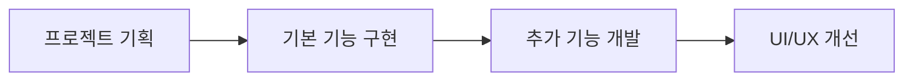
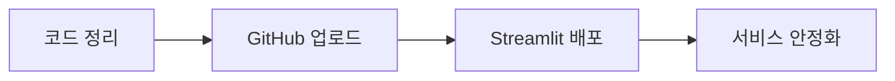

# 🤖 AI-Career-Counselor
> AI 기술을 활용한 맞춤형 진로 상담 서비스

<br>

## 🎯 Overview
`AI-Career-Counselor`는 AI 기술을 활용하여 사용자의 적성과 성향을 분석하고 맞춤형 진로를 추천해주는 상담 서비스입니다. 다양한 검사 데이터를 종합적으로 분석하여 최적의 진로 방향을 제시합니다.

<br>

## ⚙️ Tech Stack
```
Frontend: Streamlit
Backend: Python
AI Model: LangChain, OpenAI
Database: JSON
Version Control: Git
```

<br>

## 🔍 Core Features

### 1. AI 기반 진로 상담
- 종합적인 진로 분석 시스템
- 맞춤형 직업 추천
- 상세 직업 정보 제공

### 2. 사용자 친화적 인터페이스
- 직관적인 웹 인터페이스
- 애니메이션 효과와 이모지 활용
- 사이드바를 통한 편리한 네비게이션

### 3. 대화 기록 관리
- 상담 내용 자동 저장
- 이전 상담 내역 조회
- 지속적인 진로 탐색 지원

<br>

## 🛠️ Development Process

### Phase 1: 서비스 구축


### Phase 2: 배포 및 최적화


<br>

## 🚀 Getting Started

```bash
# Repository Clone
git clone https://github.com/username/AI-Career-Counselor.git

# Install Dependencies
pip install -r requirements.txt

# Run Application
streamlit run app.py
```

<br>

## 👥 Developers
- [@김나연](https://github.com/username) - 202284046
- [@박소윤](https://github.com/username) - 202284050
- [@박채현](https://github.com/username) - 202284046

<br>

## 📜 License
This project is licensed under the MIT License - see the [LICENSE.md](LICENSE.md) file for details.

<br>

---
*AI-Career-Counselor는 더 나은 진로 상담 경험을 위해 만들어졌습니다* 🎓✨
